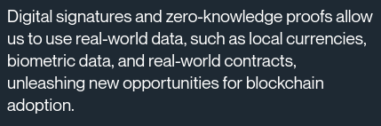

[![Telegram Chat][tg-badge]][tg-url]
[![Twitter][twitter-badge]][twitter-url]

A repository for Hyli's branding assets.

[Hyli](https://hyli.org) is the new-generation base layer for unchained applications.

## 📎 Useful Links

- [Hyli website](https://hyli.org)
- [Hyli documentation](https://docs.hyli.org)
- [Main repository](https://github.com/hyli-org/hyli)

## 🖼️ Logos

Please do not change the colors without asking for permission first.

Please use the full logo wherever possible, rather than the emblem.

### Logo

See also: [PNG images](./Logos/Logo), [SVG images](./Logos/Logo/SVG/).

### Emblem

See also: [PNG images](./Logos/Emblem/), [SVG images](./Logos/Emblem/SVG/).

Find [all our logos in PNG and SVG formats](./Logos/logos.md).

## 🎨 Colors

Hyli's main colors are:

- Orange: #DF6445
- Dark grey: #1E2933
- Light grey: #516273

As well as black (#000000) and white (#FFFFFF).

## ✒️ Typography

## Chakra Petch

**Chakra Petch** is a Google font, [usable for free](https://fonts.google.com/specimen/Chakra+Petch). We use it for most titles.

## Roboto

**Roboto** is a Google Font, [usable for free](https://fonts.google.com/specimen/Roboto). We use it for long-form text.

## Neue Montreal

Neue Montreal is a Pangram font, with [licenses starting at $30](https://pangrampangram.com/products/neue-montreal). We use it for highest-level titles.

Need anything else? Contact us directly [on Telegram](https://t.me/hyle_org), we'll be happy to help!

[twitter-badge]: https://img.shields.io/twitter/follow/hyle_org  
[twitter-url]: https://x.com/hyle_org  
[tg-badge]: https://img.shields.io/endpoint?url=https%3A%2F%2Ftg.sumanjay.workers.dev%2Fhyle_org%2F&logo=telegram&label=chat&color=neon
[tg-url]: https://t.me/hyle_org
