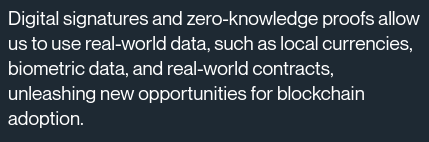

# Typography

## Chakra Petch

**Chakra Petch** is a Google font, [usable for free](https://fonts.google.com/specimen/Chakra+Petch). We use it for most titles.

## Roboto

**Roboto** is a Google Font, [usable for free](https://fonts.google.com/specimen/Roboto). We use it for long-form text.

## Neue Montreal

Neue Montreal is a Pangram font, with [licenses starting at $30](https://pangrampangram.com/products/neue-montreal). We use it for highest-level titles.

